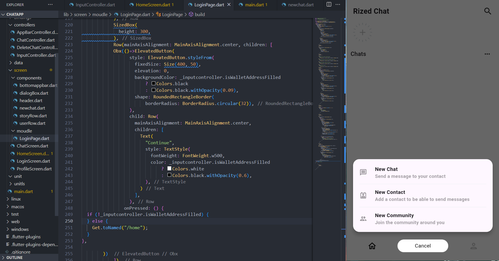

  




# ChatApp
A blockchain based chat app using truffle and ganach for testnet ->backend and Flutter for frontend.

Current State: FrontEnd ENDED.
For backend Please Contact me;

Libs used for flutter side:
```
Getx
shared_preferences

Web3Dart(Soon to be public)
http(Soon to be public)
web_socket_channel(Soon to be public)
```
Libs used for blockchain side:
```
truffle
ether
hardhat
```

``

[*] FrontEnd
    |_[*]  Login Logic
    |_[*]  Chat screen Logic and design
    |_[ ]  Intergation with SQL for saving chats localy.
    |_[ ]  Add JWT and encrypt messages when sending and recieving.
    |_[ ]  Add story and searching logic.
[*] BackEnd
    |_[*]  Contract deployed.
    |_[*]  Testing sending and recieving messages completed.
    |_[ ]  Localy intergation completed.
    |_[ ]  Ready for deploying on Ether public testnet.
    
``
Resources:
```
``
Thank you Asal Design for creating cool design:
https://dribbble.com/shots/22351367-Mengobrol-Chat-App
``

https://hardhat.org/tutorial/deploying-to-a-live-network
https://www.geeksforgeeks.org/flutter-and-blockchain-hello-world-dapp/
https://solidity-by-example.org/
https://namanrivaan.medium.com/build-your-first-dapp-using-flutter-web3-solidity-blockchain-6c8cafe36d05
```
